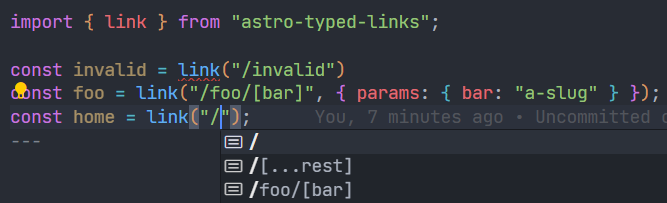

# astro-typed-links

Automatically get typed links to your pages.

To see how to get started, check out the [package README](./packages/astro-typed-links/README.md)

## Licensing

[MIT Licensed](./LICENSE). Made with ❤️ by [Florian Lefebvre](https://github.com/florian-lefebvre).
